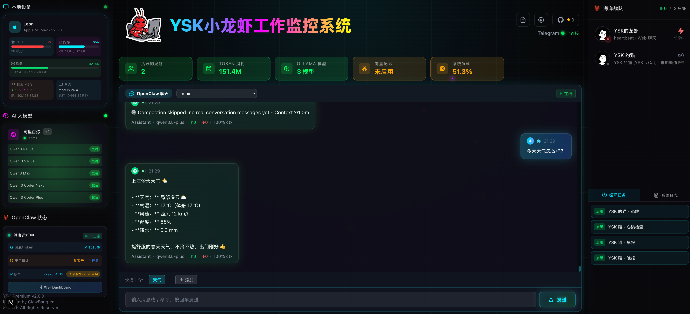

# MeetClaw - OpenClaw Dashboard

[](https://nextjs.org)
[](LICENSE)



**English** | [中文](#中文文档)

---

## 🚀 Quick Start

### Manual Install

```bash
# Clone the repository
git clone https://github.com/leonardozhe/YSK-OpenClaw-Dashboard.git
cd YSK-OpenClaw-Dashboard

# Install dependencies
npm install

# Start development server
npm run dev
```

Open [http://localhost:4000](http://localhost:4000) in your browser.

### Production Build

```bash
npm run build
npm start
```

---

## 📋 Requirements

- Node.js 20+
- npm

## 🌐 Features

- **Device Monitoring**: Real-time GPU, CPU, memory usage
- **Agent Management**: View and manage all AI agents
- **System Status**: OpenClaw gateway service monitoring
- **Terminal Access**: WebSocket terminal (requires OpenClaw Gateway)
- **Log Viewer**: System runtime logs
- **Cron Jobs**: Manage scheduled tasks

## 📁 Project Structure

```
├── src/
│   ├── app/              # Next.js App Router
│   │   ├── api/          # API Routes
│   │   ├── layout.tsx    # Root layout
│   │   └── page.tsx      # Home page
│   ├── components/       # React components
│   └── lib/              # Utilities
├── public/               # Static assets
├── next.config.ts        # Next.js config
└── package.json          # Dependencies
```

## 🎨 Customization

### Replace Brand Assets

You can customize the following assets to match your brand:

| Asset | File Path | Description |
|-------|-----------|-------------|
| **Logo** | `public/openclaw.png` | Main logo displayed in the header |
| **Avatar** | `public/avatar-team.png` | Default avatar for contacts |
| **Lobster Image** | `public/lobster.png` | Lobster character image |
| **Lobster Reference** | `public/lobster-ref.jpg` | Reference image for lobster animation |
| **Favicon** | `src/app/favicon.ico` | Browser tab icon |
| **Screenshot** | `public/ScreenShot_*.png` | README screenshot (update filename in README.md) |

### Modify Publishable Content

Before publishing, review and update:

1. **Project Name**: Search and replace "MeetClaw" with your project name
2. **GitHub URL**: Update all `github.com/leonardozhe/YSK-OpenClaw-Dashboard` references
3. **Screenshot**: Replace `public/ScreenShot_*.png` with your own screenshot
4. **Default Port**: Change port `4000` in `package.json` if needed

---

## 📄 License

MIT

---

## 中文文档

## 🚀 快速开始

### 手动安装

```bash
# 克隆仓库
git clone https://github.com/leonardozhe/YSK-OpenClaw-Dashboard.git
cd YSK-OpenClaw-Dashboard

# 安装依赖
npm install

# 启动开发服务器
npm run dev
```

在浏览器中打开 [http://localhost:4000](http://localhost:4000)。

### 生产构建

```bash
npm run build
npm start
```

---

## 📋 环境要求

- Node.js 20+
- npm

## 🌐 功能特性

- **设备监控**: 实时查看 GPU、CPU、内存使用情况
- **Agent 管理**: 查看和管理所有 AI Agent 状态
- **系统状态**: OpenClaw 网关服务状态监控
- **终端访问**: WebSocket 终端（需要 OpenClaw Gateway）
- **日志查看**: 查看系统运行日志
- **定时任务**: 管理 Cron 定时任务

## 📁 项目结构

```
├── src/
│   ├── app/              # Next.js App Router
│   │   ├── api/          # API Routes
│   │   ├── layout.tsx    # 根布局
│   │   └── page.tsx      # 主页
│   ├── components/       # React 组件
│   └── lib/              # 工具库
├── public/               # 静态资源
├── next.config.ts        # Next.js 配置
└── package.json          # 依赖配置
```

## 🎨 自定义内容

### 替换品牌资源

你可以替换以下资源来匹配你的品牌：

| 资源 | 文件路径 | 说明 |
|------|---------|------|
| **Logo** | `public/openclaw.png` | 头部显示的主 Logo |
| **头像** | `public/avatar-team.png` | 联系人默认头像 |
| **龙虾图片** | `public/lobster.png` | 龙虾角色图片 |
| **龙虾参考图** | `public/lobster-ref.jpg` | 龙虾动画参考图片 |
| **Favicon** | `src/app/favicon.ico` | 浏览器标签页图标 |
| **截图** | `public/ScreenShot_*.png` | README 截图（需要同步更新 README.md 中的文件名） |

### 修改发布内容

发布前，请检查并更新：

1. **项目名称**: 搜索并替换 "MeetClaw" 为你的项目名称
2. **GitHub 地址**: 更新所有 `github.com/leonardozhe/YSK-OpenClaw-Dashboard` 引用
3. **截图**: 替换 `public/ScreenShot_*.png` 为你自己的截图
4. **默认端口**: 如需修改，在 `package.json` 中更改端口 `4000`

---

## 📄 许可证

MIT
